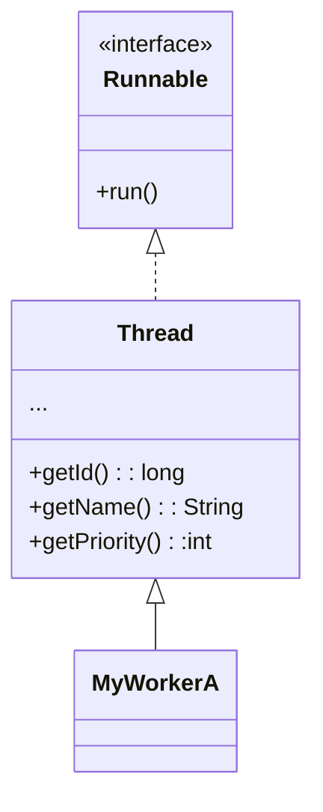

# Lab01

## Multithreaded programming in Java

- Java has been the first mainstream programming language to provide native support for concurrent programming
  - “conservative approach”: everything is still an object
  - mechanisms for concurrency
- Extended with the `java.util.concurrent` library (JSR 166 and JSR 236) to provide a higher level of support to concurrent programming
  - semaphores, locks, synchronizers, etc
  - task frameworks

- Java provides a basic API for defining new types of threads, and for dynamically creating and (partially) managing thread execution
  - **Platform threads**: are typically mapped 1:1 to kernel threads scheduled by the operating system.
    - usually have a large stack and other resources that are maintained by the operating system
    - are suitable for executing all types of tasks but may be a limited resource
  - **Virtual threads (from Java19)**: are typically user-mode threads scheduled by the Java runtime rather than the operating system
    - require few resources and a single Java virtual machine may support millions of virtual threads
    - <ins>are suitable for executing tasks that spend most of the time blocked, often waiting for I/O operations to complete</ins>
    - <ins>are not intended for long-running CPU-intensive operations</ins>
- A thread is represented by the abstract class [`Thread`](https://docs.oracle.com/en/java/javase/17/docs/api/java.base/java/lang/Thread.html#stop())
  - a concrete thread can be defined by extending `Thread` class and implementing the `run` method, which defines the behavior of the thread
  - an alternative approach is provided to define a thread, based on `Runnable` interface, useful when the class used to implement the thread belongs to some class hierarchy already extending some class, which is not `Thread` (Java does not support multiple inheritance)
  - to start thread asynchronous execution, the method `start` is provided: it returns immediately, and a new activity executing what is specified in the `run` method is launched
- The thread terminates as soon as the execution of the method run



```java
public class MyWorker extends Thread {

  public MyWorker(String name) {
    super(name);
  }

  public void run() { 
    // ...
    // <active behavior>
    // ...
  }
}
```

```java
public class MyTask implements Runnable {
  public void run() {
    // ...
    // <active behavior>
    // ...
  }
}

Thread th = new Thread(new MyTask());
th.start();
```

- When the Java virtual machine starts up, there is usually one non-daemon thread (the thread that typically calls the application's main method). The Java virtual machine terminates when all started non-daemon threads have terminated.
  - and a lot of other daemon threads: Java RMI, garbage collector, ...

## Programming Discipline

- Strong conceptual separation between **active** and **passive** entities:
  - active entities as agents that are responsible for accomplishing some tasks $\Rightarrow$ no interfaces
  - passive entities as the objects shared and manipulated by such agents to accomplish such tasks, described by a contract, i.e. their interface
- Viewing threads as <ins>**active objects encapsulating state, behavior and the control of the behavior**</ins>
  - the object's methods should be called only by the thread represented by the object
  - **the use of public methods should be minimized**, ideally no public methods; protected ones are allowed for extendibility's sake
- Promoting interaction using shared (passive) objects, not by calling public methods of their interface: this would violate encapsulation of the control flow

---


`step0`

- Un programma sequenziale ha sempre almeno il Main Thread.
  - In realtà non è così: il garbage collector, le GUI...
- il SO (non real-time) su cui è mandato in esecuzione non è deterministico lo scheduling
- incapsulamento del comportamento!
  - ha il suo stato
  - e il comportamento non è dato da un'interfaccia perché non è progettato per fornire un servizio
  - ma è lui che esegue!!! => nessun metodo pubblico, fuorché la `run`!
    - metodo protetto: per estendibilità. Estendere un componente attivo non è come per i componenti passivi
- `System.out` è un oggetto condiviso
  - i flussi di esecuzione si incrociano
- come specifico

- non è possibile terminare l'esecuzione dell'oggetto
  - ha senso nel campo più alto dell'incapsulamento: tutto ciò che condiziona e determina il comportamento è nel codice e del flusso di controllo del componente attivo

- Java19: [`Thread`](https://docs.oracle.com/en/java/javase/19/docs/api/java.base/java/lang/Thread.html)
