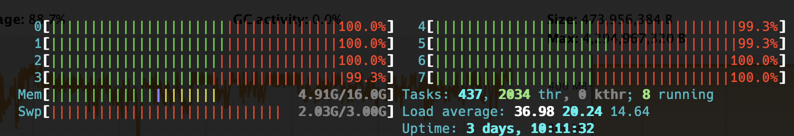

# Lab01

## Basics of Java Multithreaded programming

- Java has been the first mainstream programming language to provide native support for concurrent programming
  - “conservative approach”: everything is still an object
  - mechanisms for concurrency
- Extended with the `java.util.concurrent` library (JSR 166 and JSR 236) to provide a higher level of support to concurrent programming
  - semaphores, locks, synchronizers, etc
  - task frameworks

- Java provides a basic API for defining new types of threads, and for dynamically creating and (partially) managing thread execution
  - **Platform threads**: are typically mapped 1:1 to kernel threads scheduled by the operating system.
    - usually have a large stack and other resources that are maintained by the operating system
    - are suitable for executing all types of tasks but may be a limited resource
  - **Virtual threads (from Java19)**: are typically user-mode threads scheduled by the Java runtime rather than the operating system
    - require few resources and a single Java virtual machine may support millions of virtual threads
    - <ins>are suitable for executing tasks that spend most of the time blocked, often waiting for I/O operations to complete</ins>
    - <ins>are not intended for long-running CPU-intensive operations</ins>
    - see lab06
- A thread is represented by the abstract class [`Thread`](https://docs.oracle.com/en/java/javase/17/docs/api/java.base/java/lang/Thread.html#stop())
  - a concrete thread can be defined by extending `Thread` class and implementing the `run` method, which defines the behavior of the thread
  - an alternative approach is provided to define a thread, based on `Runnable` interface, useful when the class used to implement the thread belongs to some class hierarchy already extending some class, which is not `Thread` (Java does not support multiple inheritance)
  - to start thread asynchronous execution, the method `start` is provided: it returns immediately, and a new activity executing what is specified in the `run` method is launched
- The thread terminates as soon as the execution of the method run


```java
public class MyWorker extends Thread {

  public MyWorker(String name) {
    super(name);
  }

  public void run() { 
    // ...
    // <active behavior>
    // ...
  }
}
```

```java
public class MyTask implements Runnable {
  public void run() {
    // ...
    // <active behavior>
    // ...
  }
}

Thread th = new Thread(new MyTask());
th.start();
```
- :warning: Some important notes:
  - the method to execute the thread object is `start()`, **not** `run()`
    - If `run()` method is called directly instead of `start()`, `run()` method will be treated as a normal overridden method of the thread class (or runnable interface), just like a passive object. This run method will be executed within the context of the current thread, not in a new thread.
    - It’s the `start()` method that spawns a new thread and schedules the thread with the JVM. The JVM will let the newly spawned thread execute `run()` method when the resources and CPU are ready.
  - All the public methods to asynchronously act on the control flow of the thread have been deprecated (see [Java Thread Primitive Deprecation](https://docs.oracle.com/en/java/javase/17/docs/api/java.base/java/lang/doc-files/threadPrimitiveDeprecation.html) -- the reasons described here will be completely clear in a couple of labs...). The same functionality is achieved through proper patterns, as we will see in the following.
- When the Java virtual machine starts up, there is usually one non-daemon thread (the thread that typically calls the application's main method). The Java virtual machine terminates when all started non-daemon threads have terminated.
  - and a lot of other daemon threads: Java RMI, garbage collector, ...

### Implicit synchronization

- By applying the keyword `synchronized` as a qualifier to any code block within any method, only one thread at a time can obtain access to the object where `synchronized` is defined
  - prevents arbitrary interleaving of the actions in the method bodies
  - prevents unintended interactions among threads accessing the same objects

```java
synchronized (<object reference expression>) {     
    // <code block>
}  
```

- Suggestion: **to be used in passive objects that are shared and concurrently accessed (for updates) by multiple threads**.

### Joining Threads

- The `join()` method allows for a thread to synchronize its execution with the termination of another thread
  - in particular: `t.join()` suspends the current thread until the thread `t` has completed its execution
  - see `step03`
  
    `MyWorkerA`:
    ```java
    public void run() {
        println("a1");
        sleepFor(5000);
        println("a2");
    }
    ```

    `MyWorkerB`:
    ```java
    public void run() {
        println("b1");
        println("b2");
        try {
            workerA.join();
        } catch (InterruptedException ex){
            ex.printStackTrace();
        }
        println("b3");
    }
    ```

    Ordine delle stampe: `b3` è garantito sia stampato dopo `a2`.

### :grey_exclamation: Programming Discipline

- Strong conceptual separation between **active** and **passive** entities:
  - active entities as agents that are responsible for accomplishing some tasks $\Rightarrow$ no interfaces
  - passive entities as the objects shared and manipulated by such agents to accomplish such tasks, described by a contract, i.e. their interface
- Viewing threads as <ins>**active objects encapsulating state, behavior and the control of the behavior**</ins>
  - **the object's methods should be called only by the thread represented by the object**
  - **the use of public methods should be minimized**, ideally no public methods; protected ones are allowed for extendibility's sake
- **Promoting interaction using shared (passive) objects, not by calling public methods of their interface**: this would violate encapsulation of the control flow

### Performances and profiling

Improving performance = doing more with fewer resources.

:smiley: Multithreading benefits & costs:

- improve resource utilization, by letting applications more easily exploit available resources and processing capabilities
- improve responsiveness, by letting applications begin processing new tasks immediately while existing tasks are still running

:frowning: But also some new costs compared to single-threaded solutions:

- overhead associated with coordinating between threads: locking, signaling, memory synch
- increased context switching
- thread creation and teardown
- scheduling overhead

Three main aspects:

- **throughput**: the rate at which a set of concurrent tasks is completed
- **responsiveness**: the delay between a request for and completion of some action (also called latency)
- **scalability**: the improvement in throughput (or lack thereof) as more resources (usually CPUs) are made available

Two different kinds of objectives:

- utilize the existing processing resources more effectively
  - keeping the CPUs as busy as possible (with useful work)
- enable our program to exploit additional processing resources if they become available
  - for CPU-bound programs, increasing capacity by adding processors

### Performance testing

Main goals of performance testing:

- seeking to measure end-to-end performance metrics for representative use cases (use-case selection is important)
- selecting sizings empirically for various bounds: number of threads, buffer capacities, etc.
- testing throughput
  - how fast
  - focus on average
  - answering questions like: “How long does it take for an
operation or task to be completed on average?”
- testing responsiveness
  - how much
  - focus on variance
  - answering questions like: “What percentage of operations
will succeed in under XX milliseconds?”

:high_brightness: <ins>**Nearly all engineering decisions involve some form of tradeoff. In any case, avoid premature optimization rule:**</ins>

- <ins>**First, make it right, then make it fast (if it is not already fast enough)**</ins>
- <ins>**Don't trade safety for performance**</ins>
  - **The quest for performance is one of the more common sources of concurrency bugs**

Before deciding that one approach is faster than another, we must clarify some aspects:

- what do you mean by faster?
- under what conditions will this approach be faster? Under light or heavy load? With smaller or larger data sets? Can you support your answer with measurements?
- how often are these conditions likely to arise in your situations? Can you support your answer with measurements?
- is this code likely to be used in other situations where the conditions may be different?

:high_brightness: <ins>**Measure, don't guess.**</ins>

Measuring in java: `System` class, `nanoTime()`, `currentTimeMillis()`

#### Basic guidelines for optimizing performance: how many threads?

- The ideal size for a thread pool is related to the types of tasks that will be submitted and the characteristics of the deployment system
  - 2 basic kinds of tasks: 
    - **CPU intensive**: a system with $N$ processors usually achieves optimum utilization with a thread pool of $N + 1$ threads. The $(N+1)$-th thread is useful since even in the compute-intense case threads can get page faults or pause for some reason, so the extra runnable thread prevents CPU cycles from going unused
    - **I/O or blocking operations**: in this case, we must set a larger thread pool since not all of the threads will be schedulable at all times. How to size the pool?
      - running the application using several different pool sizes under a benchmark load and observing the level of CPU utilization
      - computing the optimal pool size for keeping the processors at the desired utilization by using the following formula:
   
      $$
      N_{THREADS} = N_{CPU} * U_{CPU} * \biggl(1 + \frac{W}{C}\biggl)
      $$

      where: $N_{CPU}$ is the number of CPU, $U_{CPU}$ is the target CPU utilization ($0 \le U_{CPU} \le 1$) and $W/C$ the ratio of wait time to compute time (estimated through profiling).

- **The size should be dynamically bounded to the number of available CPUs (not hard-coded)**
  - in Java `Runtime.availableProcessors()`

- All concurrent applications have some sources of serialization or synchronization, heavily conditioning the speedup. Often serialization is hidden in frameworks and libraries.
  - The principal threat to scalability in concurrent applications is the exclusive resource lock:
    - **reduce the duration for which locks are held** (narrow lock scope and finer lock granularity)
    - **reduce the frequency with which locks are requested**
    - **replace exclusive locks with coordination mechanisms that allow for greater concurrency**

---

#### 👨🏻‍💻 Matrix multiplication example

Concurrent programming evergreen: see `step04`.

Goal: compute the multiplication between two matrices.

Rationale: 
- `MatMulConcurLib` class spawn a number of workers equal to the number of available CPUs on the machine
- at each worker is assigned the computation of a number of rows equal to `number of rows of A / #workers` 

---

#### 👨🏻‍💻 Bouncing ball example

- For each new ball, a `BallAgent` thread is spawned.
- Despite the fact the `BallViewer` updates the GUI with the new positions of the balls 25 times per second (`FRAMES_PER_SEC`) the `BallAgent` in the loop continuously updates the position of the ball, using (wasting!) a lot of resources
  - we can think every `BallAgent` is assigned to one core of the machine
  - after spawning `NUM_CORES` balls the CPU is working at full speed just to update unnecessarily the position of the ball that is not displayed
  - if we continue to spawn other balls the CPU begins suffering and the balls start _lagging_!
  
- How to solve it? Simply, make the `BallAgent` don't waste resources recomputing in the loop the position of the ball since it is not anyway displayed! The GUI update happens every `FRAMES_PER_SEC`. Make the `BallAgent` recompute the position every `FRAMES_PER_SEC`! 
  - simply adding a `Thread.sleep(5)` solve the situation!

---

### Monitoring

- JConsole is the Java Monitoring and Management Console, a graphical tool shipped in J2SE JDK 5.0 (and later versions)
  - it uses the instrumentation of the Java virtual machine to provide information on the performance and resource consumption of applications running on the Java platform
  - Useful (also) to monitor the thread spawned by running Java programs, including VM threads, such as the one used for garbage collecting
  - simply, `jconsole` on a shell
- Similar to JConsole, VisualVm is a full-fledged profiler that allows for measuring and visualizing the performances of Java programs
  - like JConsole, it uses the instrumentation of the Java virtual machine to provide information on the performance and resource consumption of applications running on the Java platform
  - More fine-grained monitoring than JConsole:
    - monitoring % CPU used by methods, threads
    - monitoring how long a thread is blocked or running
    - ...
- Threads state in Java:
  
  - **non-runnable (blocked)**: this is the state when the thread is still alive, but is currently not eligible to run
  - **parking**: threads are being parked because it does not have permission to execute. Once permission is granted the thread will be unparked and executed.
  - ref: [stackoverflow discussion](https://stackoverflow.com/questions/27406200/visualvm-thread-states)
