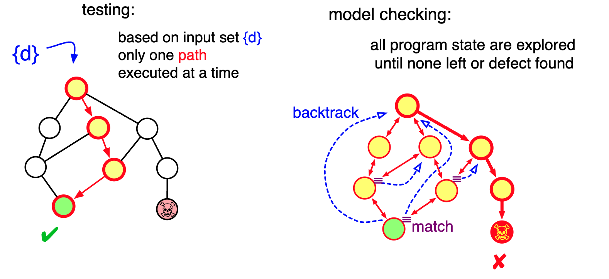

# Lab02

## Thread Safety

- A central aspect of concurrent programming is writing thread-safe code / thread-safe classes:

> A class is thread-safe if it continues to behave correctly when accessed from multiple threads:
>
> - **regardless of the scheduling or interleaving of the execution of those threads by the runtime environment**
> - **with no additional synchronization or other coordination on the part of the calling code**
>

- **Correctness** means that a class conforms to its specification
  - a good specification defines
    - **invariants** constraining an object's state
    - **post-conditions** describing the effects of its operations
- Thread-safe classes encapsulate any needed synchronization so
that clients need not provide their own

- Writing thread-safe code is – at its core – about managing access to
state and in particular to shared, mutable state:
  - **shared**: variable or object could be accessed by multiple threads
  - **mutable**: its value could change during its lifetime

- if multiple threads access the same mutable state variable without appropriate synchronization, the program is broken: _race conditions_!
  - The concurrent execution of a non-atomic sequence of statements that should be considered atomic generates race conditions
    - occur when the correctness of a computation depends on the **relative timing or interleaving** of multiple threads by the runtime (...and getting the right answer relies on lucky timing..)
  - There are three ways to fix it:
    - don't share state variables across threads
    - make the state variable immutable
    - use synchronization whenever accessing the state variable
  - :point_right: Stateless/Immutable objects are always thread-safe: actions of a thread accessing a stateless object cannot affect the correctness of operations in other threads. Thread safety is undermined as soon as we share and access in R/W stateful objects, mutable state-full objects, in particular
    - In functional programming the absence of shared mutable state makes multithreading safe

### Atomic compound actions in Java

As we have introduced in the previous lab compound-actions - and atomic statement blocks - in Java can be realized using synchronized blocks or methods (see `cs-raw` package).

```java
synchronized(lock) { 
    statement
    statement
    statement
}
```

A synchronized block has 2 parts:

- a reference to an object that will serve as the lock
- block of code to be guarded by the lock

Mostly used at a method level: we will see in the following labs when we'll discuss monitors.

:arrow_right: Atomic blocks work by exploiting the **lock** embedded **in each** Java object called **intrinsic lock** (or monitor lock) functioning as a guard for the block.
The lock is automatically acquired and then released by a thread
respectively when entering and exiting the block:

- if the lock is already acquired, the thread is blocked (suspended) and added to the entry set
- when a thread exited the block, one thread of the entry set is selected and re-activated
- **no ordering policy is specified**
- if the lock is not released by the thread inside the block, threads in the entry set are blocked forever (**starvation**!)

For static methods and fields, the lock is associated with the related class object.

The misuse of atomic blocks can lead to performance problems or misbehavior, like sequentializations, which leads to a strong impact on speed-up and worsening performances.
Attention should be paid to which parts must be designed and implemented as critical sections, **minimizing the time in which a lock is retained**.

### Race conditions

Two main examples

- **lost updated**
  - when executing concurrently non-atomic read-modify-write operations
  - see `lost_updates` package
    - running multiple times `TestCounter.java` different counter values are returned due to the fact the update of the counter is not made inside a critical section
    - `lost_updates_fixed` package contains the correct version, in which the increment of the counter is performed inside a `synchronized` block

- **check-and-act**
  - when a potential state observation is used to decide on what to do next, but since check+act are not atomic, the state can change after the check and before acting
    ```
    if (file X doesn't exists) <--- check
        then create file X <------- act
    ```
  - see `check_act` and `check_act_fixed`

## Model Checking with JPF

- Java Pathfinder (JPF) is an open-source system to verify executable Java bytecode programs.
  - It was developed at the Robust Software Engineering Group at NASA Ames Research Center
  - open-sourced since 04/2005: [jpf-core GitHub repo](https://github.com/javapathfinder/jpf-core), [jpf wiki](https://github.com/javapathfinder/jpf-core/wiki)
- The core of JPF is a Java Virtual Machine. JPF executes normal Java bytecode programs and can store, match and restore program states. **It executes programs** not just once (like a normal VM), but theoretically **in all possible ways, <ins>checking for property violations</ins> like deadlocks or unhandled exceptions <ins>along with all potential execution paths</ins>**.
  - Its primary application has been Model checking of concurrent programs, to find defects such as data races and deadlocks.
- <ins>Difference between testing and model checking</ins>:
  

<!--

- Una classe si dice _thread-safe_ se è stata pensata e concepita per funzionare correttamente in contesti multithreaded
  - ci permette di incapsulare la responsabilità della correttezza del codice se mandato in esecuzione su più thread e solleva la responsabilità del client che deve usarlo
- se stiamo parlando di oggetti che non hanno stato o lo stato è immutabile, allora possono essere condivisi da più thread e non ci dobbiamo preoccupare della thread-safety
  - nella programmazione funzionale non ci saranno problemi di corretteza
- l'attenzione si pone quando c'è uno stato condiviso
  - è sufficiente che l'oggetto esponga dei metodi pubblici che permettono la modifica
  - laddove non ci proteggiamo => race condition

Race conditions

2 famiglie:
- lost updates: due thread che incrementano lo stesso contatore
- check-and-act: errore molto frequente

- ogni oggeetto java ha un intrinsec lock
  ```java
  synchronized(lock) {
      statement 
      statement
      statement
  }
  ```

...

## Lost Updates
- più alto è il valore, più è alta la probabilità che via sia interleaving

MAI PRENDERE IL LOCK SU COMPONENTI ATTIVI :)
-->