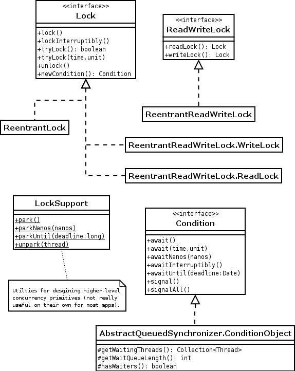

# Lab03

## Liveness hazards

Thread-off between _safety_ and _liveness_:

- Locks are essentials to ensure thread safety 
  - :boom: but indiscriminate use of locking can cause **"lock-ordering" deadlocks**;
- Thread pools and semaphores are essential to bind resource consumption 
  - :boom: but failure to understand activities being bounded can cause **resource deadlocks**.

### Deadlock

A situation wherein two or more competing actions are waiting for the other to finish, and thus neither ever does.

A deadlock can only occur in systems where all the following 4 conditions are satisfied (Coffman, 1971):

- **mutual exclusion**
  - a resource that cannot be used by more than one process at a time;
- **hold and wait condition**
  - processes already holding resources may request new resources;
- **no preemption condition**
  - no resource can be removed from a process holding it
  - resources can be released only by the explicit action of the process
- **circular wait condition**
  - two or more processes form a circular chain where each process
waits for a resource that the next process in the chain holds

Deadlock with locks happens when multiple threads wait forever due to cyclic locking dependency.

1. The simplest case: thread $A$ holds lock $L$ and try to acquire lock $M$, but at the same time thread $B$ holds $M$ and tries to acquire $L$, both threads will wait forever.
   - see `liveness.deadlocked_resource` package

<ins>**Deadlocks detection and recovery**</ins>

- in databases:
  - databases are designed to detect and recover from deadlocks
  - transactions typically acquire many locks, until they commit
  - not so uncommon for two transactions to deadlock
- identifying the set of transactions that are deadlocked by analyzing _is-waiting_ dependency graph
  - looking for cycles
  - if a cycle is found, a victim is selected and the transaction aborted
- **No automated deadlock detection / recovery mechanism in JVM**
  - if threads deadlock, that’s all folks!
    - we can just restart the application
  - “post-mortem” diagnosis support:
    - _Thread dump_ support provided by the JVM triggered by sending the JVM process a `SIGQUIT` signal on UNIX (`kill -3`) or by simply pressing `CTRL-\` on UNIX (or CTRL-Break on Windows) or using, for example, VisualVM.
    

    (Legend -- `Monitor` state means threads are waiting on a condition to become true to resume execution)

    ```
    2023-03-28 17:18:50
    Full thread dump OpenJDK 64-Bit Server VM (17+35-2724 mixed mode, sharing):

    Threads class SMR info:
    _java_thread_list=0x00006000011f0340, length=21, elements={
    0x00007fca8e8c6000, 0x00007fca8f044600, 0x00007fca8f04a200, 0x00007fca8f04a800,
    0x00007fca8f04ae00, 0x00007fca8f04b400, 0x00007fca8e8ca000, 0x00007fca8e8ca600,
    0x00007fca8e8cac00, 0x00007fca8e908a00, 0x00007fca8d80e200, 0x00007fca8e909600,
    0x00007fca8e909c00, 0x00007fca7f008200, 0x00007fca8e8fe000, 0x00007fca8e905a00,
    0x00007fca8f179c00, 0x00007fca8ecdee00, 0x00007fca8f2bf600, 0x00007fca8ea43200,
    0x00007fca7f808200
    }

    ...

    Found one Java-level deadlock:
    =============================
    "Thread-0":
    waiting to lock monitor 0x0000600002adc270 (object 0x000000070e8203a8, a java.lang.Object),
    which is held by "Thread-1"

    "Thread-1":
    waiting to lock monitor 0x0000600002ad0270 (object 0x000000070e8203b8, a java.lang.Object),
    which is held by "Thread-0"

    Java stack information for the threads listed above:
    ===================================================
    "Thread-0":
            at pcd.lab03.liveness.deadlocked_resource.Resource.rightLeft(Resource.java:18)
            - waiting to lock <0x000000070e8203a8> (a java.lang.Object)
            - locked <0x000000070e8203b8> (a java.lang.Object)
            at pcd.lab03.liveness.deadlocked_resource.ThreadA.run(ThreadA.java:17)
    "Thread-1":
            at pcd.lab03.liveness.deadlocked_resource.Resource.leftRight(Resource.java:10)
            - waiting to lock <0x000000070e8203b8> (a java.lang.Object)
            - locked <0x000000070e8203a8> (a java.lang.Object)
            at pcd.lab03.liveness.deadlocked_resource.ThreadB.run(ThreadB.java:17)

    Found 1 deadlock.
    ```

2. A more sneaky example: accounts management (see `liveness.deadlock_account` package)
   - Deadlock came because two (or more) threads attempted to acquire the locks in a different order <ins>without a common policy<ins>
     - thread dump of `TestAccountsWithDeadlock`:
       ```
       Found one Java-level deadlock:
       =============================
       "Thread-0":
       waiting to lock monitor 0x0000600000320d00 (object 0x000000070e8181a0, a pcd.lab03.liveness.deadlock_account.Account),
       which is held by "Thread-1"

       "Thread-1":
       waiting to lock monitor 0x0000600000325040 (object 0x000000070e820198, a pcd.lab03.liveness.deadlock_account.Account),
       which is held by "Thread-18"

       "Thread-18":
       waiting to lock monitor 0x0000600000320d00 (object 0x000000070e8181a0, a pcd.lab03.liveness.deadlock_account.Account),
       which is held by "Thread-1"
       ```
     - this is the situation in which: inside `Thread-0` $A$ wants to send money to $B$ so it acquires the lock on $A$ and attempts to acquire the lock on $B$; in the meanwhile, because inside `Thread-1` $B$ wants to send money to $C$, it acquires the lock on $B$ before the `Thread-0` can do so, blocking it waiting for the `Thread-1` releases the lock on $B$. At this point, `Thread-1` should acquire the lock on $C$, but before doing so, `Thread-18`, which wants to send money from $C$ to $B$, acquires the lock on $C$, preventing `Thread-1` from entering the critical section. Now on, `Thread-18` attempts to acquire the lock on $B$, which is already hold by `Thread-1`: deadlock :skull:!
        ```
        Thread-0                   Thread-1                Thread-18
        A --> B                    B --> C                 C --> A
        1) lock A            |---> 2) lock B           |-> 4) lock C
        3) attempt lock B x->|     5) attempt lock C ->|   6) attempt lock B ->|
                             |------------------------<------------------------|
       ```

   - How to fix? If they asked for the locks in the same order, there would be no cyclic locking dependency and therefore no deadlock: <ins>**a program will be free of lock-ordering deadlocks if all threads acquire the locks they need in a fixed global order**</ins>
     - introduce `AccountManager` entity which acquires the lock on the sender and receiver based on their id
        ```java
        int first = Math.min(from, to);
        int last = Math.max(from, to);
        synchronized (accounts[first]) {
            synchronized (accounts[last]) {
                // transfer
            }
        }
        ```
     - running `TestAccountsNoDeadlock` and running VisualVM. No more deadlock :smile:.

   - :speech_balloon: Alternative technique: timed locks: detecting and recovering from deadlocks using `tryLock` feature of [`Lock`](https://docs.oracle.com/en/java/javase/17/docs/api/java.base/java/util/concurrent/locks/Lock.html) classes instead of the intrinsic lock (see `TestAccountsNoDeadlockWithLock.java` + `AccountWithLock.java`)
     - `tryLock` semantic: acquires the lock only if it is free at the time of invocation. Acquires the lock if it is available and returns immediately with the value true. If the lock is not available then this method will return immediately with the value false.
        ```java
        if (fromAcct.lock.tryLock()) {
            try {
                if (toAcct.lock.tryLock()) {
                    try {
                        // logic
                    } finally {
                        toAcct.lock.unlock();
                    }
                }
            } finally {
                fromAcct.lock.unlock();
            }
        }
        ```

   - Verifying consistent lock ordering requires a global analysis of your program's locking behavior.

    > :arrow_right: <ins>***Takeaway***</ins>: A program that never acquires more than one lock per time cannot have lock-ordering deadlock. **If we must acquire multiple locks, lock order must be part of the design**, minimizing the number of potential locking interactions and **documenting a lock-ordering protocol for locks that may be acquired together.**

3. <ins>**Deadlocks in cooperating objects, in which no methods explicitly acquire two locks, but where this happens indirectly**</ins>
   - a common example: Observer pattern
   - the more general problem: event-oriented pattern implementation in OO languages in which control flows among sources and observers of events are coupled
   - see `liveness.observer` package
   - consider the following:
      1. `UpdateAgent` call the `update()` method on the observed object, which performs the update; now the agent should notify the observers that its state has changed, **but**...
      2. Before the `UpdateAgent` enters inside the observer monitor (calling the `notifyStateChanged()` on it), the `ListeningAgent` calls the `getOverallState()` method on the observer object (acquiring the lock), which consequently calls the `getState()` method on each observed object. This function cannot be performed because the `UpdateAgent` has still the mutual exclusion on the object.
      3. Now the `UpdateAgent` continues, trying to call the `notifyStateChanged()`, but this function cannot be performed either because the `ListeningAgent` has still the mutual exclusion on the object.
      4. DEADLOCK! :skull:

    > :arrow_right: <ins>***Takeaway***</ins>: the state change notification **must not** transfer the control flow.
    > 
    > This is also an Item of Effective Java (Item 79: Avoid excessive synchronization)
    > 
    > "To avoid liveness and safety failures, **never cede control to the client within a synchronized method or block**. In other words, inside a synchronized region, do not invoke a method that is design to be overridden, or one provided by a client in the form of a function object. **From the perspective of the class with the synchronized region, such methods are _alien_.** The class has no knowledge of what the method does and has no control over it. Depending on what an alien method does, calling it from a synchronized region can cause exceptions, deadlock, or data corruption"
    >

### Other liveness hazard

- **Starvation**
  - typically manifested when using priorities
  - basic thread support for priorities in Java thread is “deprecated”
    - platform dependent
    - liveness problems
- **Poor responsiveness**
  - e.g. executing long-term tasks in GUI thread
  - can also be caused by poor lock management
    - if a thread holds a lock for long time - for instance while iterating on a large collection and performing substantial work on each element - other threads that need to access that collection may have to wait long time
- **Livelock**
  - when threads cannot make progress because they keep retrying
an operation that will always fail
  - solution: introducing some randomness into the retry mechanism
    - breaking the synchronization that causes the live-lock

## Thread Coordination in Java - Library support

The Java platform libraries (Java 5.0 & Java 6.0) include a rich set of concurrent building blocks such as thread-safe collections and a variety of synchronizers that can coordinate the control flow of cooperating threads:

- Synchronized Collections
- Concurrent Collections
- Synchronizers

### Synchronized Collections

- Since Java 1.2
- Synchronized wrappers
  - created by [`Collections.synchronizedXXX`](https://docs.oracle.com/en/java/javase/17/docs/api/java.base/java/util/Collections.html) factory methods
  - achieving thread-safety by _encapsulating_ the state + _synchronizing_ every public method serializing all access to the collection's state
  - Problems:
    - need to use additional client-side locking to guard compound actions, including iteration, navigation, conditional operations such as put-if-absent. 

      ---
      From Java doc:

      ```java
      public static <T> List<T> synchronizedList(List<T> list)
      ```

      Returns a synchronized (thread-safe) list backed by the specified list. In order to guarantee serial access, it is critical that all access to the backing list is accomplished through the returned list.
      It is imperative that the user manually synchronizes on the returned list when traversing it via Iterator, Spliterator or Stream:

      ```java
      List list = Collections.synchronizedList(new ArrayList());
          ...
      synchronized (list) {
          Iterator i = list.iterator(); // Must be in synchronized block
          while (i.hasNext())
              foo(i.next());
      }
      ```

      Failure to follow this advice may result in non-deterministic behavior.
      The returned list will be serializable if the specified list is serializable.

      ---

    - the object to be used for client-side locking in the synchronized collection object itself
    - performances: locking the collection for long-term operations, such as iteration, strongly limits concurrency. This is due to the fact synchronized collections lock the whole collection.


### Concurrent Collections

- Since Java 1.5
- Designed for concurrent access from multiple threads greatly improving scalability and performance concerning synchronized collections
  - they achieve thread safety by using advanced and sophisticated techniques like lock stripping. 
  - For example, the `ConcurrentHashMap` divides the whole map into several segments and locks only the relevant segments, which allows multiple threads to access other segments of the same `ConcurrentHashMap` without locking.
  - Similarly, `CopyOnWriteArrayList` allows multiple reader threads to read without synchronization and when a write happens it copies the whole ArrayList and swaps with a newer one.
  - So if you use concurrent collection classes in their favorable conditions like for more reading and fewer updates, they are much more scalable than synchronized collections.


Some notes:

- Bounded queue as a basic building block for producer-consumer design pattern
  - powerful resource management tool for building reliable applications, making programs more robust to overload by throttling activities that threaten to produce more work than can be handled

- [`Deque`](https://docs.oracle.com/javase/8/docs/api/java/util/Deque.html) and [`BlockingDeque`](https://docs.oracle.com/javase/8/docs/api/java/util/concurrent/BlockingDeque.html) are used for _work stealing_ design pattern
  
  ---

  **Deque** = "double ended queue": A linear collection that supports element insertion and removal at both ends. It is usually pronounced "deck".

  A **BlockingDeque** is a deque that additionally supports blocking operations that wait for the deque to become non-empty when retrieving an element, and wait for space to become available in the deque when storing an element.

  ---

  - similar to producers-consumers
  - each consumer has its deque
  - if a consumer exhausts the work in its deque, it can steal work from the tail of someone else’s deque
  - More scalable than _producers-consumers_:
    - workers don’t contend for a shared work queue: most of the time they access only their own deque, reducing contention
    - when accessing others’ deque, the access is from the tail, not from the head: further reducing contention

### Synchronizers

A _synchronizer_ is any object that coordinates the control flow of threads based on its state (a blocking queue can function as a synchronizer).

They represent a very important building block of concurrent applications: passive components encapsulating coordination functionalities.

All synchronizers share the following structural properties:

- encapsulating state that determines whether threads arriving at the synchronizers should be allowed to pass or forced to wait
- providing methods to manipulate that state
- providing methods to wait efficiently for the synchronizer to enter in the desired state

Main types provided with Java library:

- **_Locks_**
  - Providing explicit lock functionality vs. intrinsic lock given by synchronized blocks
    
  - Typical usage:
    ```java
    Lock lock = new ReentrantLock();
    ...
    // If the lock is not available then the current thread
    // becomes disabled for thread scheduling purposes and lies
    // dormant until the lock has been acquired.
    lock.lock();
    try {
        // update shared object state
        // catch exception and restore invariants if necessary
    } finally {
        // Releases the lock.
        lock.unlock();
    }
    ```
  - `tryLock()` for polled and timed lock acquisition to have a more sophisticated error recovery
    - see `TestAccountsNoDeadlockWithTryLock.java` for an use example
  - `lockInterruptibly()`: acquires the lock unless the current thread is interrupted.
  - [`ReadWriteLock`](https://docs.oracle.com/en/java/javase/17/docs/api/java.base/java/util/concurrent/locks/ReadWriteLock.html): A ReadWriteLock maintains a pair of associated locks, one for read-only operations and one for writing. The read lock may be held simultaneously by multiple reader threads, so long as there are no writers. The write lock is exclusive.
  - Aside: `ReentrantLock` throughput is about 4 times than intrinsic lock

- **_Semaphores_**
  - Implementation of Dijkstra’s basic semaphore construct
  - [`Semaphore`](https://docs.oracle.com/en/java/javase/17/docs/api/java.base/java/util/concurrent/Semaphore.html) class
    - created specifying the number of virtual permits
    - `acquire` + `release` method
    - possibility to enforce _fairness_ in the constructor: 
      ```java
      Semaphore(int permits, boolean fair)
      ```
  - see `semaphore` + `semaphore.pingpong` packages

- **_Latches_**
  - A latch is a synchronizer that can delay the progress of a thread until it reaches its terminal state, functioning as a gate:
    - until the latch reached the terminal state, the gate is closed and no thread can pass
    - in the terminal state, the gate opens allowing all threads to pass
    - once the latch reaches the terminal state, it cannot change the state again and so it remains open forever!
  - `CountDownLatch` class:
    - ```java
      CountDownLatch(int count)
      ```
    - `countDown()` method to decrement the counter
    - `await()` method that causes the current thread to wait until the latch has counted down to zero unless the thread is interrupted.
    
  - Used to ensure that certain activities do not proceed until other one-time activity complete. Main examples:
    - ensuring a computation does not proceed until the resources it needs have been initialized
    - ensuring that a service does not start until other services on which it depends have started
    - waiting for all parties involved in an activity (e.g: players in a multiplayer game) to be ready to proceed
  - see `latches` package
- **_Barriers_**
  - similar to latches in that they block a group of threads until
some event has occurred
  - the key difference is that in this case, all the threads must come together at a barrier point at the same time in order to proceed
  - [`CyclicBarrier`](https://docs.oracle.com/en/java/javase/17/docs/api/java.base/java/util/concurrent/CyclicBarrier.html)
    - ```java 
      CyclicBarrier(int parties, Runnable barrierAction)
      ```
      Creates a new CyclicBarrier that will trip when the given number of parties (threads) are waiting upon it, and which will execute the given barrier action when the barrier is tripped, performed by the last thread entering the barrier.
      
    - Actually, it is a **Cyclic** barrier: with `reset()` method is possible reset the barrier to its initial state
      
    - see `barrier` package

> Latches are for waiting for events, barriers for other threads