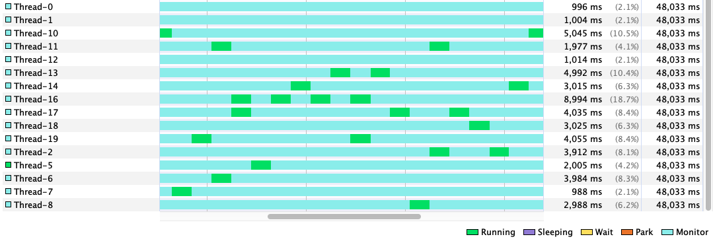

# Lab03

## Liveness hazards

Thread-off between _safety_ and _liveness_:

- Locks are essentials to ensure thread safety 
  - :boom: but indiscriminate use of locking can cause **"lock-ordering" deadlocks**;
- Thread pools and semaphores are essential to bind resource consumption 
  - :boom: but failure to understand activities being bounded can cause **resource deadlocks**.

### Deadlock

A situation wherein two or more competing actions are waiting for the other to finish, and thus neither ever does.

A deadlock can only occur in systems where all the following 4 conditions are satisfied (Coffman, 1971):

- **mutual exclusion**
  - a resource that cannot be used by more than one process at a time;
- **hold and wait condition**
  - processes already holding resources may request new resources;
- **no preemption condition**
  - no resource can be removed from a process holding it
  - resources can be released only by the explicit action of the process
- **circular wait condition**
  - two or more processes form a circular chain where each process
waits for a resource that the next process in the chain holds

Deadlock with locks happens when multiple threads wait forever due to cyclic locking dependency.

- The simplest case: thread $A$ holds lock $L$ and try to acquire lock $M$, but at the same time thread $B$ holds $M$ and tries to acquire $L$, both threads will wait forever.
  - see `liveness.deadlocked_resource` package

<ins>**Deadlocks detection and recovery**</ins>

- in databases:
  - databases are designed to detect and recover from deadlocks
  - transactions typically acquire many locks, until they commit
  - not so uncommon for two transactions to deadlock
- identifying the set of transactions that are deadlocked by analyzing _is-waiting_ dependency graph
  - looking for cycles
  - if a cycle is found, a victim is selected and the transaction aborted
- **No automated deadlock detection / recovery mechanism in JVM**
  - if threads deadlock, that’s all folks!
    - we can just restart the application
  - “post-mortem” diagnosis support:
    - _Thread dump_ support provided by the JVM triggered by sending the JVM process a `SIGQUIT` signal on UNIX (`kill -3`) or by simply pressing `CTRL-\` on UNIX (or CTRL-Break on Windows) or using, for example, VisualVM.
    

    (Legend -- `Monitor` state means threads are waiting on a condition to become true to resume execution)

        ```
        2023-03-28 17:18:50
        Full thread dump OpenJDK 64-Bit Server VM (17+35-2724 mixed mode, sharing):

        Threads class SMR info:
        _java_thread_list=0x00006000011f0340, length=21, elements={
            0x00007fca8e8c6000, 0x00007fca8f044600, 0x00007fca8f04a200, 0x00007fca8f04a800,
            0x00007fca8f04ae00, 0x00007fca8f04b400, 0x00007fca8e8ca000, 0x00007fca8e8ca600,
            0x00007fca8e8cac00, 0x00007fca8e908a00, 0x00007fca8d80e200, 0x00007fca8e909600,
            0x00007fca8e909c00, 0x00007fca7f008200, 0x00007fca8e8fe000, 0x00007fca8e905a00,
            0x00007fca8f179c00, 0x00007fca8ecdee00, 0x00007fca8f2bf600, 0x00007fca8ea43200,
            0x00007fca7f808200
        }

        ...

        Found one Java-level deadlock:
        =============================
        "Thread-0":
        waiting to lock monitor 0x0000600002adc270 (object 0x000000070e8203a8, a java.lang.Object),
        which is held by "Thread-1"

        "Thread-1":
        waiting to lock monitor 0x0000600002ad0270 (object 0x000000070e8203b8, a java.lang.Object),
        which is held by "Thread-0"

        Java stack information for the threads listed above:
        ===================================================
        "Thread-0":
                at pcd.lab03.liveness.deadlocked_resource.Resource.rightLeft(Resource.java:18)
                - waiting to lock <0x000000070e8203a8> (a java.lang.Object)
                - locked <0x000000070e8203b8> (a java.lang.Object)
                at pcd.lab03.liveness.deadlocked_resource.ThreadA.run(ThreadA.java:17)
        "Thread-1":
                at pcd.lab03.liveness.deadlocked_resource.Resource.leftRight(Resource.java:10)
                - waiting to lock <0x000000070e8203b8> (a java.lang.Object)
                - locked <0x000000070e8203a8> (a java.lang.Object)
                at pcd.lab03.liveness.deadlocked_resource.ThreadB.run(ThreadB.java:17)

        Found 1 deadlock.

        ```

A more sneaky example: accounts management (see `deadlock_account` package)

- Deadlock came because two (or more) threads attempted to acquire the locks in a different order <ins>without a common policy<ins>
  - thread dump of `TestAccountsWithDeadlock`:
    ```
    Found one Java-level deadlock:
    =============================
    "Thread-0":
    waiting to lock monitor 0x0000600000320d00 (object 0x000000070e8181a0, a pcd.lab03.liveness.deadlock_account.Account),
    which is held by "Thread-1"

    "Thread-1":
    waiting to lock monitor 0x0000600000325040 (object 0x000000070e820198, a pcd.lab03.liveness.deadlock_account.Account),
    which is held by "Thread-18"

    "Thread-18":
    waiting to lock monitor 0x0000600000320d00 (object 0x000000070e8181a0, a pcd.lab03.liveness.deadlock_account.Account),
    which is held by "Thread-1"
    ```
  - this is the situation in which: inside `Thread-0` $A$ wants to send money to $B$ so it acquires the lock on $A$ and attempts to acquire the lock on $B$; in the meanwhile, because inside `Thread-1` $B$ wants to send money to $C$, it acquires the lock on $B$ before the `Thread-0` can do so, blocking it waiting for the `Thread-1` releases the lock on $B$. At this point, `Thread-1` should acquire the lock on $C$, but before doing so, `Thread-18`, which wants to send money from $C$ to $A$, acquires the lock on $C$, preventing `Thread-1` from entering the critical section. Now on, `Thread-18` attempts to acquire the lock on $A$, which is already hold by `Thread-0`: deadlock :skull:!
    ```
         Thread-0                 Thread-1                Thread-18
         A --> B                  B --> C                 C --> A
    |--> 1) lock A           |--> 2) lock B           |-> 4) lock C
    |    2) attempt lock B x-|    5) attempt lock C --|   6) attempt lock A ->|
    |--------------------------------------<----------------------------------|
    ```

- How to fix? If they asked for the locks in the same order, there would be no cyclic locking dependency and therefore no deadlock: <ins>**a program will be free of lock-ordering deadlocks if all threads acquire the locks they need in a fixed global order**</ins>
  - introduce `AccountManager` entity which acquires the lock on the sender and receiver based on their id
  - running `TestAccountsNoDeadlock` and running VisualVM
    
    No more deadlock :smile:.
    :warning: Note that if the number of accounts is greater than 3 could happen that more threads are simultaneously in their critical section (due to the fact they are sending money from and to different receivers, e.g. $A \rightarrow B \land C \rightarrow D$).

- Verifying consistent lock ordering requires a global analysis of your program's locking behavior.

## Semaphores
