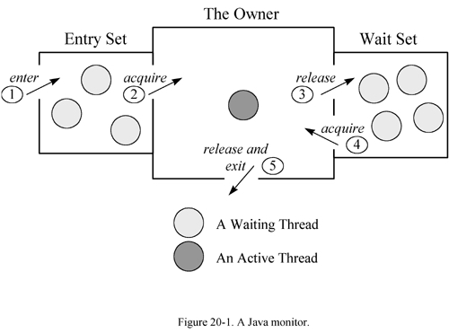
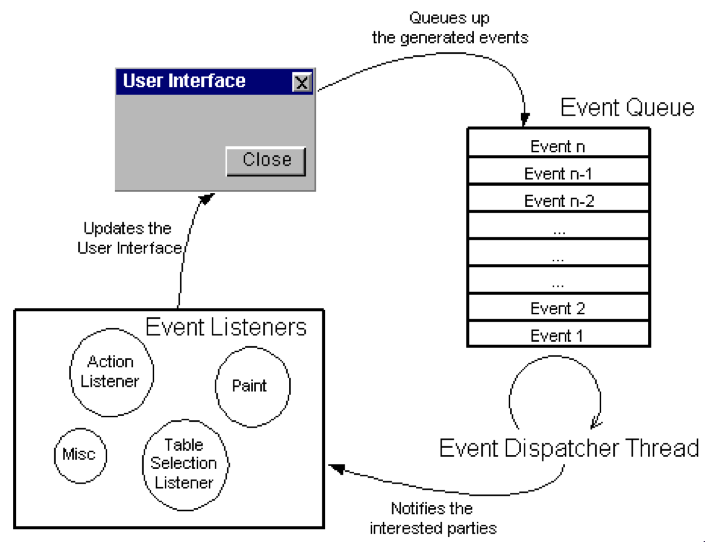

# Lab04

## Implementing monitors in Java

Two basic approaches to developing monitors in Java:

1. exploiting low-level Java mechanisms (synchronized, wait, notify, notifyAll)
2. exploiting high-level `java.util.concurrent` support

### 1. Explicit synchronization


- `wait()` method: any synchronized method in any object can contain a `wait()` call, which suspend the current thread
  - If the current thread has been interrupted, then the method exits immediately, throwing an `InterruptedException`, otherwise the current thread is blocked
  - The JVM places the thread in the internal and otherwise inaccessible wait set associated with the target object
  - **The synchronization lock for the target object is released, but all other locks held by the thread are retained**
    - A full release is obtained even if the lock is re-entrantly held due to nested synchronized calls on the target object
    - upon later resumption, the lock status is fully restored
  - The timed versions of the wait method, `wait(long msecs)` and `wait(long msecs, int nanosecs)`, take arguments specifying the desired maximum time to remain in the wait set, after which the lock is automatically released.
 
- `notify()` method: one (arbitrarily chosen) thread waiting on the target object is resumed upon invocation of this method (must be contained in a synchronized method or block)
  - If one exists, an arbitrarily chosen thread, say `T`, is removed by the JVM from the internal wait set associated with the target object. <ins>There is no guarantee about which waiting thread will be selected when the wait set contains more than one thread.</ins>
  - `T` must re-obtain the synchronization lock for the target object, which will always cause it to block at least until the thread calling `notify()` releases the lock.
    - It will continue to block if some other thread obtains the lock first.
  - `T` is then resumed from the point of its wait

- `notifyAll()` method: all threads waiting on the target object are resumed upon the invocation of this method on the target object (must be contained in a synchronized method or block)
  - :warning: because they must acquire the lock, threads continue one at a time

:warning: If `Thread.interrupt()` is invoked for a thread suspended in a wait, the same notify mechanics apply, except that after re-acquiring the lock, the method throws an `InterruptedException` and the thread's interruption status is set to false.
If an interrupt and a notify occur at about the same time, there is no guarantee about which action has precedence, so either result is possible (future revisions of JLS may introduce deterministic guarantees about these outcomes).

> An object following the monitor pattern encapsulates all its mutable state and guards it with object’s own intrinsic lock.
>
> Rules:
>
> - every public method must be implemented as synchronized
> - no public fields
> - monitor code must access / use only objects completely confined inside the monitor
> - a single condition variable is available, which is the object itself
>   -  `wait`, `notify`, `notifyAll` as `waitC` and `signalC`

<ins>**Limits of the Java basic support**</ins>

- multiple condition predicates must be associated with the same unique condition variable
  - multiple threads with different roles waiting for different condition predicates can be waiting on the same (implicit) condition variable
  - to awake the desired threads, all the threads waiting on the condition variable must be awakened
- wait semantics include “spurious wake up” ([check Java doc](https://docs.oracle.com/en/java/javase/17/docs/api/java.base/java/lang/Object.html#wait(long,int)))
  - > "A thread can wake up without being notified, interrupted, or timing out, a so-called spurious wakeup. While this will rarely occur in practice, applications must guard against it by testing for the condition that should have caused the thread to be awakened, and continuing to wait if the condition is not satisfied. See the example below."
  - **The recommended approach to waiting is to check the condition being awaited in a while loop around the call to wait**, as shown in the example below. Among other things, this approach avoids problems that can be caused by spurious wakeups.
    ```java
    synchronized (obj) {
        while (<condition does not hold> and <timeout not exceeded>) {
            long timeoutMillis = ... ; // recompute timeout values
            int nanos = ... ;
            obj.wait(timeoutMillis, nanos);
        }
        ... // Perform action appropriate to condition or timeout
    }
    ```

First simple example: `SyncCell` (see `monitors.sync_cell` package).

More complex example: `BoundedBuffer` (see `monitors.bounded_buffer` package).
  - Is it really necessary to use `notifyAll()`? Actually no... (see below)
 
---

In Java the signaling semantic is a variant of the Signal-and-Continue strategy: $E = W < S$ where $E$ = precedence of processes blocked on a procedure, $W$ = precedence of the waiting processes and $S$ = precedence of the signaling processes.

See `monitors.signaling_semantic` package.



- Entry set: set where threads waiting for the lock are suspended
- Wait set: set where threads that executed a wait are waiting to be notified

---

## 2. Exploiting high-level support

Exploiting explicit locks with `ReentrantLock` and `Condition` classes implementing condition variables provided by `java.util.concurrent` library.

As we have seen in previous lab:

- `ReentrantLock` class is a reentrant implementation of locks
- `Condition` class represents condition variables to be used only inside blocks protected by a `ReentrantLock`
  - a condition object is strictly coupled to a specific reentrant lock (in order to release it when the `wait` is called on it)
  - method of `Lock` interface to create the condition to use:
    ```java
    public Condition newCondition();
    ```
    

- How to implement a monitor with `ReentrantLock` + `Condition`? 
  - `ReentrantLock` mutex for each monitor
  - wrapping each method with `mutex.lock()` and `mutex.unlock()`
  - for each condition to use, create it from the mutex lock
  - `synchronized` blocks / methods (intrinsic locks) are not used

See `SyncCell2.java` and `BoundedBuffer2` to see revisited the previous example with the new approach.
In the new version of `BoundedBuffer` example is signalled only the specific condition variable!

### What approach choose?

Item 81, Effective Java: ***Prefer concurrency utilities to `wait` and `notify`***:

> "Since Java 5, the platform has provided higher-level concurrency utilities that do the sorts of things you formerly had to hand-code atop `wait` and `notify`.
> **Given the difficulty of usign `wait` and `notify` correctly, you should use the higher-level concurrency utilities instead**."

## GUI

Once upon a time GUI applications were single-threaded and GUI events were processed by a “main event loop”.
Modern GUI frameworks are not so different: there is **a dedicated event dispatch thread (EDT) for handling GUI events which fetches events off a queue and dispatches them to application-defined event handlers**.



Multithreaded GUI are a “failed dream”: many attempts failed due to the generation of problems with race conditions and deadlocks. Most of the modern GUI Frameworks are single-threaded:

- <ins>all GUI objects are accessed exclusively by the event thread</ins>
- <ins>the application developer must make sure that these objects are properly confined</ins>

Problems and challenges:

- **if one task takes long time to execute, other tasks must wait blocking the overall GUI...**
  - `gui1_unresponsive` + `gui2_mvc_unresponsive` examples: in both examples the EDT calls the controller which executes a (sleep-simulated) long-term task and the entire GUI freeze 🥶
- **... so tasks that execute in the event-thread must return quickly**
- **to start long-term computations a separate control flow (thread) must be used. However, tipically, a long-term task must provide a visual feedback for indicating progress or when it completes and this code need to be executed by the EDT!**
  - see `gui3_mvc_deadlock` package: inside the controller, a new thread (on-the-fly) is created. Now the application becomes smooth!
  - more robust solution: consider offloading the task to a thread pool (as a master-worker solution) to avoid the cost of thread creation and to limit the number of threads to be used, besides the fact it is more elegant
- Since all Swing/JavaFX components and data models (table model, tree model) are confined to the EDT **any code that access these objects must run in the event thread**
  - `SwingUtilities.isEventDispatchThread`: to check if the current thread is the event thread
  - `SwingUtilities.invokeLater`: to schedule a Runnable for execution on the event thread
  - `SwingUtilities.invokeAndWait`: to schedule a Runnable task for execution on the event thread, blocking the current thread until it completes (it cannot be called by the event thread)
    - :collision: be aware of deadlocks! See package `gui3_mvc_deadlock`: when the model is updated the thread calls the `modelUpdated()` method and then blocks until the EDT has completed the GUI update but, since the model is designed as a monitor, the calling thread still holds the lock on it and the EDT should access it to retrieve the current state but cannot (because the lock is held still by the calling thread)! As we saw in the previous lab, never call "alien" method from a synchronized region!
    - the solution is simple: replace `invokeAndWait` with `invokeLater`
  - methods to enqueue and repaint or revalidation requests on the event queue
  - methods for adding or removing listeners can be called from any thread, but listeners will always be invoked in the event thread

### Toward a cleaner design

> Key points:
>
> - **encapsulating control in agents**
>   - active components of the program
>   - encapsulating the control logic
> - **application Model as shared passive components**
>   - can be used by agents
>   - encapsulating mutex properties + includes coordination media $\rightarrow$ **monitors** 
> - **View as shared passive components + one active component**
>   - passive components
>     - enabling and mediating the interaction with users
>     - observed and used by agents
>   - active component (EDT)
>     - responsible for executing any tasks about the GUI

See `gui.chrono2_strict` package.
