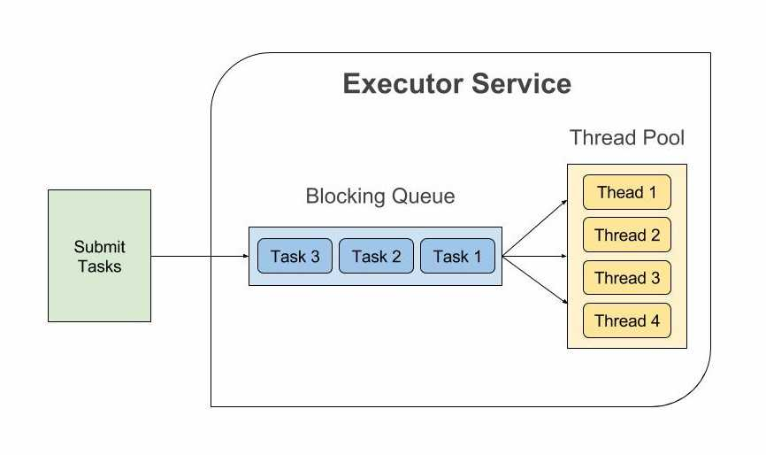

# Lab06

## Executors

Recall:

- **task**: abstract, discrete, independent unit of work uncoupled from the notion of thread
- **Division of Labor pattern (aka divide-et-impera strategy)**
  - conceive tasks as independent activities, **not** depending on state/results/side-effects of other tasks
  - choose a **task execution policy** (objectives: good throughput, good responsiveness, grace-full degradation)

:arrow_right: from JDK 5.0 support for **decoupling task submission from task execution**: tasks are logic unit of work, threads the mechanism by which the task can run <ins>asynchronously</ins>.

Pool-based vs. Thread-per-task approach:

- Better performance
- Strong impact on application stability (e.g. a web server no longer fail under heavy load)

Overview:

![executor-interfaces](http://www.plantuml.com/plantuml/svg/dLPDR-Cu3BtdLsXzIZojznuKmHITwMA0nUwYoNOkSv5j9j54bWo9QXiC-j-NacNP-UfqDeVMeaYA8XyVzT4YD-WQoU05AeVQN0k5ODQy0ZkPjBpQyGsmx_o95mw5B2gjAcSCA6G_9XD6lwJFFaSNjCFYxqFd5gQLRXgkwZbxS4hnKi8iwBo6lqeZCDGjq-la9BcuLKoNtw52XbkECKwmB2bOLpO24Uhaco6tEri43L1ry7ySxBr3P-3cSJ6EDiytWDFPd3tc-I3rCXGDQ8Tp9hNQN36d17slIFWlVSq6NM7lkAf0IgYzdr9h2LoDzpzf1MUtgc0u_QRygk7xBpvMurhyilON4sgJZBwf8mUdUUpkbxm_G6l0KjaifH4OVJk9NcyK0RTxLMsDLjfPHWLh7N8KMXL98y-pB6GeorWfTRMpx9aBfD16-Shpw5rOEeVN-z_YvgLIz6KRIW8lICesNc9S8UFKz0GwfKRKZR_DeQi1Gxsd90bO4dR8JpHy6pJBQWkrezfU3FLSK4TMewXga7mFTP9qYRikWHlAwL2OofUXYpa92IwiX8DrXxjpLwWajtsCAseE7xbeMWbDWCHHsaOcVJlQSH5-M0-CwfKfU5vIe19MMr_fNjd3k_zUWdaI5PmtlkC-DPtnFmJdTnlUYvS3EzLzspcZhdclaw_Qx2Zw9GANz3yuQhdXb4GfRDFv6aoBedWBUYbJoUAUwgRDdbgiPfuy1UvP0xZL19SrqMHFkNPeiB-fEKrIcj82_3a4Z5ORehWPjVTGSReoXP1b2M17ryuoUuW5lnWgMhYsA1R7kPf7l_OIlKUzXFnpj9_d7IjFFHFFsHtbrEFhPhMWuiJcMIt69CizaQp0D485qda_uwedlODRASDPX80xJGKC7NCpEdTnQgBsls1Ybrk7jNvM5sYz3_q2xzjaVIhxIpzxcp-5nPk-4nSZe1qdFh-MiCRhCSK7B1gnsU8OYdr5vrqnqicVO-LARY62RU2HBEjdTXhLMPPsotq73-gNW6i358EVJOC3JYwwq6XA1Cxgg2efE4kp6dLahDW6dk065wh-dG3b8H4wnGyZ2Lxd5Cy_kNggzUY2IKO1VXZMKj8wgRK4UsqQofAJEwPf6N1fVpc2lip9yn-6scdj93lO-Jyk2Jd3D2dzM-62pqjpx6SztSj7hMsZRNoeLB5VHat-kBZgzi9uYmtSIGwxE3nZJcVgwLct60Z_WTfhIZGyEzNuAd0RT3xvCmUbrpS7ygKnGM_EdfpFJDt-p96qUzqEr4_effSAuslAE3N4HZp12DuXBrVCEzVzW_O0U4BNmYTsVpJBNoUJZxIWz_f_ "executor-interfaces")

- `Executor` interface: an object that executes submitted `Runnable` tasks, providing a way of decoupling task submission from the mechanics of how each task will be run, including details of thread use, scheduling, etc. An `Executor` is normally used instead of explicitly creating threads.
- `ExecutorService` provides methods to manage termination and methods that can produce a `Future` for tracking the progress of one or more asynchronous tasks.
  - tasks are modeled by a `Callable<V>` functional interface
    - `call()` method encapsulates the behavior of the task doing some kind of computation and returning some kind `V` of value
  - A `Future` represents the result of an asynchronous computation. Methods are provided to check if the computation is complete, to wait for its completion, and to retrieve the result of the computation. The result can only be retrieved using the method `get` when the computation has been completed, **blocking if necessary until it is ready.**
- `Executors` provides factory and utility static methods for `Executor`, `ExecutorService`, `ScheduledExecutorService`, `ThreadFactory`, and `Callable` classes. Most commons ones:
  - `FixedThreadPool`:
    - one thread for each task up to the maximum pool size
    - keep the pool size constant
  - `CachedThreadPool`:
    - reap idle threads when pool size > current demand
    - create new threads if needed
    - no bounds
  - `SingleThreadExecutor` 
    - single worker, replacing it if dies unexpectedly
    - task guaranteed to be processed according to the task queue order (FIFO, LIFO, order)
  - `ScheduledThreadPool`
    - fixed-size thread pool
    - support for delayed and periodic task execution

### Matrix multiplication example

- see `lab06.executors.matmul` package
- For every element of the target matrix a task is created and assigned to a **`FixedThreadPool`** executor
  - All of them are fully indipendent from each other
  - The task is modeled by the `ComputeElemTask` class
  - The creation of the executor and the **asynchronous** submission to the executor service of the tasks is performed in the `MatMulConcurLib` class
- After submitting all the tasks to the executor service waits the results have been computed (and the target matrix populated)
  - calling **blocking** `awaitTermination()`
- Note the result matrix is created and passed to the constructor of each task

### Task independence

:warning: **In the Java Executor framework tasks must be independent**

- e.g. a task cannot wait for another task
  - reason: by blocking a task (e.g., on an event semaphore) we are going to block also the physical thread running the task $\rightarrow$ <ins>**_deadlock possibility_**</ins>
- see `lab06.executors.deadlock` package
  - here we create a _logically correct_ synchronization point with a barrier initialized to the number of tasks with the goal of blocking the tasks until the barrier collapse, but the tasks are executed, under the hood, by "platform" threads which stop their execution when `barrier.await()` is called, preventing executing other threads waiting in the queue
    - :boom: consequence: after #NUM-OF-CPU threads in your machine reaches the `barrier.await()` line the process goes in deadlock!

### Quadrature problem example

- see `lab06.executors.quad*` package
- problem: compute the definite integral of a given function between $[a, b]$ with the quadrature rule.
- Version 1: `lab06.executors.quad1_basic`
  - `QuadratureService` is the class in charge of creating and asynchronously submitting the tasks to the executor service
    - as before the pool is fixed and **after all threads have been submitted the service await the termination, blocking itself**
  - the task is defined by the `ComputeAreaTask` and is in charge of calculating the area (i.e. the integral) of a given function between a sub-interval of the domain
  - **the result (`QuadratureResult`) is updated within each tasks: in order to avoid race conditions it is implemented as a monitor**

- Version 2: `lab06.executors.quad2_withsynch`
  - the only difference is that the `QuadratureService` no more waits for the result to be ready with an `executor.awaitTermination` call
  - the collection of the result is performed through the `QuadratureResult` monitor
    - calling `getResult` blocks the caller until the result is ready
    - emulating the `Future` mechanism (see following step)

- **_Version 3 -- THE WAY: `lab06.executors.quad2_withfuture`_**
  - no more monitors to represent the result, using low level synchronized, signals and wait...
  - using instead the `Feature` mechanism: the `submit` method of the executor service returns a `Feature` on which the service can block waiting for the result

### Fork join

<ins>**Outcomes**:</ins>

- simplify program organization
- facilitates error recovery by providing natural transaction boundaries
- promotes concurrency

### `CompletableFuture`

## Java Virtual Threads
TO FINISH!

