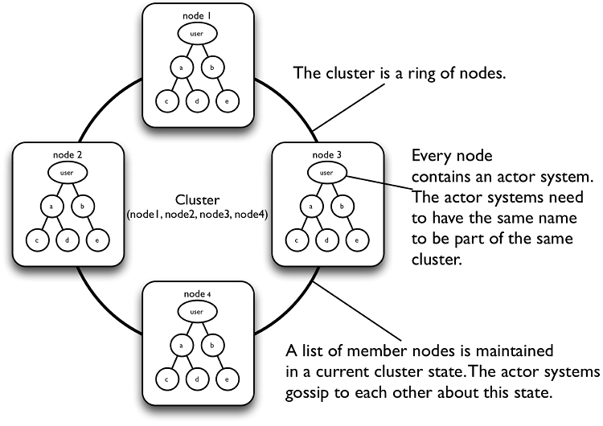
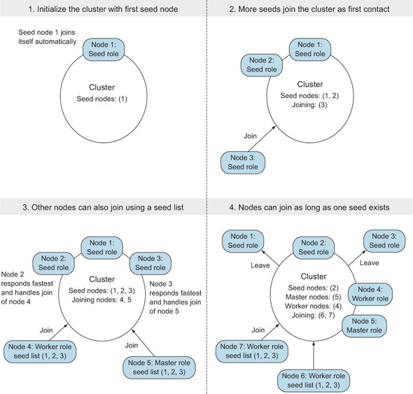

# Lab10

## Distributed Actors in Akka

### Artery

### Clustering

Note: see the example project for build configuration.

- Akka cluster: a group of Actor Systems (that live in independent JVM) communicating P2P to form a whole
  - location transparency: no matter an actor is in the same node or not, its location is transparent 
  - no single point of failure
  - fault-tolerant
  - can dynamically increase and decrease the number of nodes



Goal of the cluster module: provide fully automated features for actor distribution and failover.

**:warning: Important warning** - we recall:
- **at-most-once delivery, i.e. no guaranteed delivery**
  - means that for each message handed to the mechanism, that message **is delivered once or not at all**; in more casual terms <ins>**it means that messages may be lost.**</ins>
    - if we want to be sure the message is received we must implement an _ad hoc_ protocol using acknowledgement messages
- **message ordering per sender–receiver pair**
  - for a given pair of actors, messages sent directly from the first to the second will not be received out-of-order:
  - Example:
    - Actor A1 sends messages M1, M2, M3 to A2.
    - Actor A3 sends messages M4, M5, M6 to A2.
    1. If M1 is delivered it must be delivered before M2 and M3
    2. If M2 is delivered it must be delivered before M3
    3. If M4 is delivered it must be delivered before M5 and M6
    4. If M5 is delivered it must be delivered before M6
    5. A2 can see messages from A1 interleaved with messages from A3
    6. Since there is no guaranteed delivery, any of the messages may be dropped, i.e. not arrive at A2

Basic concepts:

- **node**:  logical member of cluster, identified by `hostname:port:uid` (there could be multiple nodes on the same physical machine)
- **cluster**: set of nodes joined together through _Cluster Membership Service_
- **leader**: cluster node that manages cluster convergence and membership state transitions

Basic configuration:

- **provider**: local/cluster. The first is used for apps that do not require distributions; the second to allow actors to be created in any node.
- **remote**: internal foundational mechanism
- **cluster.seed-nodes**: list of hosts ports and actor system names of the start nodes (`localhost` may not be equal to `127.0.0.1` depending on your setup).

```conf
akka {
  actor {
    provider = "cluster"
    serialization-bindings {
      "it.unibo.pcd.akka.Message" = jackson-cbor
    }
  }
  remote.artery {
    canonical {
      hostname = "127.0.0.1"
      port = 2551
    }
  }

  cluster {
    seed-nodes = [
      "akka://ClusterSystem@127.0.0.1:2551",
      "akka://ClusterSystem@127.0.0.1:2552"]
  }
}
```

<ins>**Cluster membership**</ins>

First option: joining a cluster programmatically knowing the address of a member, sending a `Join` message.
The following line sends a message to the cluster manager actor to join the cluster with the address of the current cluster member. The `Join` message is used to request a node to join the cluster. By sending this message to the cluster manager, the current cluster member (represented by `cluster.selfMember.address`) requests to join the cluster.
```scala
cluster.manager ! Join(cluster.selfMember.address)
```

Second option: a few "founders" are required to start the process. Akka provides **seed nodes** for this purpose, which are starting point of the cluster and serve as the **first point of contact for other nodes**. Other nodes can join the cluster through one of the seed nodes once the first seed node is started and up.



- _Configuration_: passing a config of initial node addresses. Used for local development or testing. Not recommended to use in production (we will use it in the following).
- _Cluster bootstrap_: programmed to find the nodes in cloud environments such as Kubernetes, AWS, Azure, ... . This is the recommended approach.
- _Programmatically_: using an implementation written ad-hoc.

See `basics.Joining` + `basics.ShowEvents` sources:
```scala
@main def withSeedAndLeave(): Unit =
  val system1 = startup(port = 2551)(Behaviors.empty)
  val system2 = startup(port = 2552)(Behaviors.empty)
  Thread.sleep(10_000)
  Cluster(system1).manager ! Leave(Cluster(system1).selfMember.address)
```


Akka-Remote has started with TCP protocol and this canonical address
```
Remoting started with transport [Artery tcp]; listening on address [akka://ClusterSystem@127.0.0.1:2551] with UID [-3082908305885740943]

Cluster Node [akka://ClusterSystem@127.0.0.1:2551] - Starting up
```

Node started successfully in cluster mode
```
Cluster Node [akka://ClusterSystem@127.0.0.1:2551] - Started up successfully
```

Not automatic downing available for unreachable nodes (see later).
```
No downing-provider-class configured, manual cluster downing required
```

```
Remoting started with transport [Artery tcp]; listening on address [akka://ClusterSystem@127.0.0.1:2552] with UID [-4963127196782143602]

Cluster Node [akka://ClusterSystem@127.0.0.1:2552] - Starting up

Cluster Node [akka://ClusterSystem@127.0.0.1:2552] - Started up successfully
```

Actor `ClusterSystem@127.0.0.1:2552` receives an "InitJoin" message from actor `ClusterSystem@127.0.0.1:2551`, which is attempting to join the cluster. However, the receiving node has not completed its initialization process yet, and therefore cannot accept new members into the cluster. The `InitJoinNack` message is used to reject the join request. 
```
Cluster Node [akka://ClusterSystem@127.0.0.1:2552] - Received InitJoin message from [Actor[akka://ClusterSystem@127.0.0.1:2551/system/cluster/core/daemon/firstSeedNodeProcess-1#209040171]], but this node is not initialized yet

Cluster Node [akka://ClusterSystem@127.0.0.1:2551] - Received InitJoin message from [Actor[akka://ClusterSystem@127.0.0.1:2552/system/cluster/core/daemon/joinSeedNodeProcess-1#1123547397]], but this node is not initialized yet

Cluster Node [akka://ClusterSystem@127.0.0.1:2551] - Received InitJoinNack message from [Actor[akka://ClusterSystem@127.0.0.1:2552/system/cluster/core/daemon#386892605]] to [akka://ClusterSystem@127.0.0.1:2551]
```

Seed automatically join itself.
```
Cluster Node [akka://ClusterSystem@127.0.0.1:2551] - Node [akka://ClusterSystem@127.0.0.1:2551] is JOINING itself (with roles [dc-default], version [0.0.0]) and forming new cluster
[2023-06-12 09:34:54,530]
```

After the output confirms that the leader node has switched to `Up` and is ready to accept other nodes. The role of the leader node is to manage the convergence of the cluster and the membership transitions. Only one node can be the leader at any time and any node of the cluster can become the leader.
```
Cluster Node [akka://ClusterSystem@127.0.0.1:2551] - is the new leader among reachable nodes (more leaders may exist)

Cluster Node [akka://ClusterSystem@127.0.0.1:2551] - Leader is moving node [akka://ClusterSystem@127.0.0.1:2551] to [Up]
```

Node `ClusterSystem@127.0.0.1:2552` join the cluster and gets an ack from the leader.
```
Cluster Node [akka://ClusterSystem@127.0.0.1:2551] - Received InitJoin message from [Actor[akka://ClusterSystem@127.0.0.1:2552/system/cluster/core/daemon/joinSeedNodeProcess-1#1123547397]] to [akka://ClusterSystem@127.0.0.1:2551]

Cluster Node [akka://ClusterSystem@127.0.0.1:2551] - Sending InitJoinAck message from node [akka://ClusterSystem@127.0.0.1:2551] to [Actor[akka://ClusterSystem@127.0.0.1:2552/system/cluster/core/daemon/joinSeedNodeProcess-1#1123547397]] (version [2.6.19])

Cluster Node [akka://ClusterSystem@127.0.0.1:2552] - Received InitJoinAck message from [Actor[akka://ClusterSystem@127.0.0.1:2551/system/cluster/core/daemon#442992817]] to [akka://ClusterSystem@127.0.0.1:2552]

Cluster Node [akka://ClusterSystem@127.0.0.1:2551] - Node [akka://ClusterSystem@127.0.0.1:2552] is JOINING, roles [dc-default], version [0.0.0]

Cluster Node [akka://ClusterSystem@127.0.0.1:2552] - Welcome from [akka://ClusterSystem@127.0.0.1:2551]

Cluster Node [akka://ClusterSystem@127.0.0.1:2551] - Leader is moving node [akka://ClusterSystem@127.0.0.1:2552] to [Up]
```

After 10 secs is sent a `ClusterCommand` to make the leader leave the cluster. **When this happens, the next node - the one with the lowest IP - takes over the role of leader.** 
In the output, you can see that node 2551 marks itself as _Leaving_ and then _Exiting_ while still being the leader. **These state changes are propagated to all nodes in the cluster.** 
Looking at the terminal of node 2552 you can see the confirmation of the exit and removal or the leader and the election of a new leader.
```
Cluster Node [akka://ClusterSystem@127.0.0.1:2551] - Marked address [akka://ClusterSystem@127.0.0.1:2551] as [Leaving]

Cluster Node [akka://ClusterSystem@127.0.0.1:2551] - Exiting (leader), starting coordinated shutdown

Cluster Node [akka://ClusterSystem@127.0.0.1:2551] - Leader is moving node [akka://ClusterSystem@127.0.0.1:2551] to [Exiting]

Cluster Node [akka://ClusterSystem@127.0.0.1:2551] - Exiting completed

Cluster Node [akka://ClusterSystem@127.0.0.1:2551] - Shutting down...

Cluster Node [akka://ClusterSystem@127.0.0.1:2551] - Successfully shut down

Cluster Node [akka://ClusterSystem@127.0.0.1:2552] - Exiting confirmed [akka://ClusterSystem@127.0.0.1:2551]

...

Cluster Node [akka://ClusterSystem@127.0.0.1:2552] - is the new leader among reachable nodes (more leaders may exist)

Cluster Node [akka://ClusterSystem@127.0.0.1:2552] - Leader is removing confirmed Exiting node [akka://ClusterSystem@127.0.0.1:2551]
```

There are other ways to leave the cluster:

- graceful exit via coordinated shutddown, e.g. `system.terminate()` or by root actor termination
- (graceful exit via HTTP or JMX)
- non-graceful exit, e.g. in case of an abrupt termination, the node will be detected as **unreachable** by other nodes and removed after _Downing_, see below.

---

As you have seen the seed node 2552 knew about the fact the leader was leaving, exiting and removed.
To do so, Akka uses **gossip protocol**: every node gossips to other nodes about its own state and the states that it has seen, making it possible for all nodes in the cluster to reach _convergence_, i.e. to **eventually** agree about the state of every node.

A leader is elected after convergence: the first node (in sort order) that is `Up` automatically becomes the leader (The full remote address of the node is used to sort nodes, like `akka.tcp://words@127.0.0.1:2551`.)

If a node is unreachable then gossip convergence is not possible and therefore most leader actions are impossible. 
By enabling `akka.cluster.allow-weakly-up-members` (which is enabled by default), joining nodes can be promoted to `WeaklyUp` even while convergence is not yet reached. Once gossip convergence can be established again, the leader will move `WeaklyUp` members to `Up`.

--- 

In order to receive cluster state changes (e.g. to be notified of a node leaving the cluster) it is possible to use **subscriptions**.
You can subscribe an actor to cluster events by using the subscriptions method on the `akka.cluster.typed.Cluster`.

```scala
val subscriber: ActorRef[MemberEvent]
cluster.subscriptions ! Subscribe(subscriber, classOf[MemberEvent])
```

#### Cluster singleton

- singleton actor which has only one instance in the entire cluster. This instance is assigned to the oldest node, that is, the one with the lower IP, and is automatically moved when its node is removed from the cluster.
  - It makes sure that at most one singleton instance is running at any point in time.
- used to provide a single point of access (logger, coordinator, job manager, ...)
- :warning: **it can be considered an anti-pattern because it can become a single point of failure or a bottleneck in the application**
  - :poop: This is because **if it has a critical responsibility for the system, the application breaks when it fails**. Whether you use it or not, every decision is a tradeoff.
  - :rotating_light: The cluster failure detector will notice when oldest node becomes unreachable due to things like JVM crash, hard shut down, or network failure. After Downing and removing that node the a new oldest node will take over and a new singleton actor is created.
  - messages can always be lost because of the distributed nature of these actors. As always, additional logic should be implemented in the singleton (acknowledgement) and in the client (retry) actors to ensure at-least-once message delivery.

Actor behavior:
```scala
object MyBehavior {
  def apply(): Behavior[String] = Behaviors.Ignore
}
```

If you have an actor system you can create the singleton factory as follows.
```scala
val singletonFactory = ClusterSingleton(system)
```

Then you need to wrap your behavior in a SingletonActor and make sure you set up the supervision strategy to restart.
The proxy will route all messages to the current instance of the singleton, keep track of the oldest node in the cluster and discover the singleton’s ActorRef. There might be periods during which the singleton is unavailable, e.g., when a node leaves the cluster. In these cases, the proxy will buffer the messages sent to the singleton and then deliver them when the singleton is finally available. If the buffer is full the proxy will drop old messages when new messages are sent via the proxy. The size of the buffer is configurable and it can be disabled by using a buffer size of 0.
```scala
val wrappedBehavior = SingletonActor(
  Behaviors
    .supervise(MyBehavior())
    .onFailure(SupervisorStrategy.restart),
  "myShardingCoordinator"
)
```

With these two now you can create the singleton as follows:
```scala
val mySingletonActor = singletonFactory.init(wrappedBehavior)
```

It doesn't matter how many times you run this line of code in your application, there will only ever be one instance available in the cluster. 

**:warning:** You have to keep in mind that this actor is not persistent; that is, it loses its state every time it is moved from one node to another. You need to add a persistence mechanism yourself to make its state durable.

## Java RMI

## MOM


## References

- [Akka in Action](https://livebook.manning.com/book/akka-in-action-second-edition/welcome/v-13)
- [Akka documentation](https://doc.akka.io/docs/akka/current/typed/cluster-membership.html#state-diagrams)